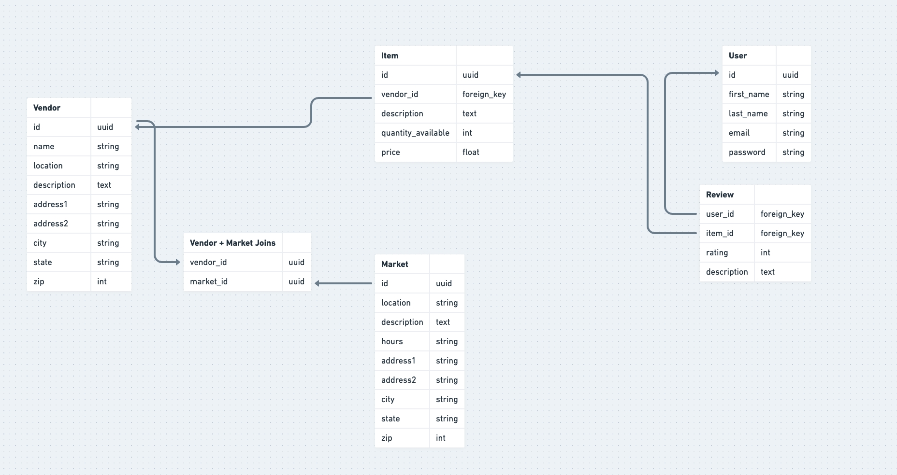

# Farmers market server code

_Baker Moran_
_01/10/2022_

## The why

This is a simple project to allow me to mess around with a few technologies that I have not gotten much exposure to. I worked on this as a quick hack-day project at Root after a few days of research and video watching.

### Typescript

Typescript seems to be growing rapidly, so I wanted to get some experience using it. I am a big fan of strong typing (which we unfortunately don't get any of at Root). In college, most of my CS classes were C++ based, so I have a lot of familiarity with strong typing and value the pros of it. While it can be a bit verbose while writing, I think it saves a lot of time in the end and greatly simplifies errors. After using typescript a bit, I think it's basically only a good thing. It adds a _bit_ of clunkiness, but I think this trade off is worth it in the end, especially with JS being as notorious as it is.

### Node

At Root, we use Ruby on Rails on the backend. I wanted to broaden my horizons as far as backend technologies I am comfortable with. As I was pretty comfortable with JavaScript from our front end development and prior experience, I figured backend JS would be a good next step. I have some experience using Python and Django as well, so figured node would be different enough to give me a little bit of a challenge.

### GraphQL

GraphQL is a hugely popular technology (with good reason) that I also had pretty minimal exposure to. My main motivation for wanting to learn it was to get exposure to a whole different paradigm of APIs that is pretty different from the way we've thought about them for a long time. After a couple days of use, I think it's a really cool way to think about data transfer, if a bit clunky to write at first. I wanted to get in the nitty gritty of it, so I didn't use any code generators or anything, which perhaps hampered my speed, but all in all I think graphQL is really cool and seems like a really nice way to write APIs, especially when endpoints are re-used for multiple purposes without a lot of data overlap.

## What did I build?

This is a hypothetical marketplace for farmers markets (or other types of markets). Farmers markets are growing in popularity, and are popping up in lots of cities around the US. A lot of times, these are local to a neighborhood, with larger cities such as San Francisco having 15-20 on a weekly basis. If you love cooking, or just love fresh produce, this is a lot of information to keep track of! The idea would be that this is a single website for a city, which lists all of the markets in the city, all of their vendors, and their available products. It would additionally allow for users, reviews, and potentially online ordering. I mostly picked this because I like cooking and farmers markets, and while relatively simple, the data model was sufficiently complex for a couple day project, but could be expanded if needed.

This is the data model I came up with. The allows for a bit of continued future work if I want to come back to it.

[Whimsical link](https://whimsical.com/farmers-market-data-model-PnAKtHyJx8xbz7TCzkUH3G@2Ux7TurymNAzERKMKszd)

## Next steps

I didn't get to any front end code, which I would really like to. This would allow me to continue using TypeScript, and see how it pairs with React which is part of what I initially set out to do. I also want to get some experience consuming data on the front end from graphQL, which I did not get to do here. Early on in the hack-days, I did some learning about redux and the `useReducer` hook in react as well, which I would like to do some playing around with. When I first learned react, class components were pretty standard, so I want to get some experience with hooks and writing only functional components.
